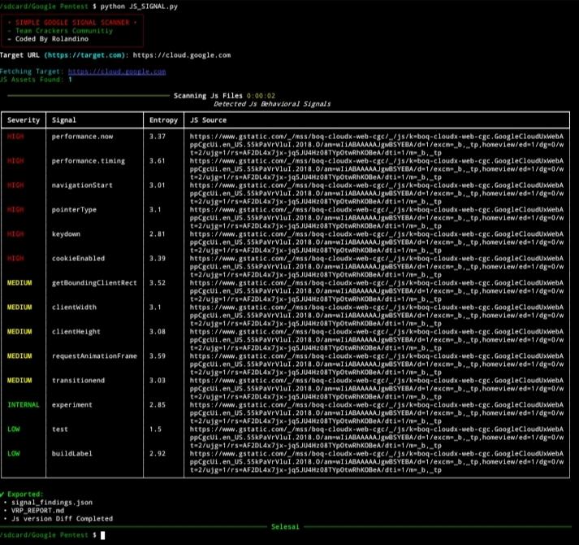

# Simple Js Signal Scanner

**Passive JavaScript Behavioral & Telemetry Signal Analyzer**



---

## Overview

**Simple Js Signal Scanner** adalah tool Python untuk melakukan **analisis pasif terhadap file JavaScript publik** dengan fokus pada **behavioral signals, telemetry, dan internal markers** yang umum digunakan oleh Google.

Tool ini **TIDAK**
- melakukan exploit
- melakukan auth bypass
- mengirim payload
- melakukan brute force

Semua analisis dilakukan secara **read-only (passive inspection)** terhadap JavaScript publik.

---

## Purpose

Tool ini dibuat untuk membantu:

- Security research (Google VRP style)
- Identifikasi behavioral fingerprinting
- Deteksi telemetry & performance monitoring
- Analisis experiment / rollout / canary signal
- Menemukan indikator internal Google JS framework

---

## Key Features

- Passive scan seluruh JavaScript eksternal
- Deteksi **Behavioral Signals** berbasis keyword
- Severity classification:
  - HIGH
  - MEDIUM
  - INTERNAL
  - LOW
- Hashing JS menggunakan **SHA256** (version tracking)
- Entropy calculation untuk setiap signal
- Terminal UI interaktif (Rich)
- Auto export report:
  - `signal_findings.json`
  - `VRP_REPORT.md`

---

## Install & Requirements

- Python **3.10+**
- Dependencies:
```bash
pip install requests beautifulsoup4 rich
```
---

## How It Works
- Fetch HTML target
- Extract seluruh <script src="">
- Download JavaScript
- Hitung SHA256 setiap JS (Versioning)
- Scan konten JS berdasarkan kategori SIGNAL
- Hitung entropy setiap signal
- Tampilkan hasil di terminal
- Export laporan otomatis (Report)

---

## Signal Severity Classification
- Visibility state
- Performance timing
- Pointer & keyboard activity
- Network conditions
- Storage access
- Device capability
## Medium 
- Layout measurement
- Observer APIs
- Animation lifecycle
- Viewport & scrolling
## Internal
- AF_initData*
- boq*
- experiment / rollout
- clearcut / beacon
- webpack internals
- internal headers & identifiers
## Low 
- feature flags
- environment labels
- build version
- analytics hooks

---

## Output Files
**signal_findings.json**
- Berisi seluruh signal yang terdeteksi Contoh

  ```bash {
  "severity": "HIGH",
  "signal": "document.visibilityState",
  "js": "https://www.google.com/js/main.js",
  "hash": "9a2f4d8c...",
  "entropy": 3.41
  ```

---

## VRP_REPORT.md
**Ringkasan siap pakai untuk laporan VRP / internal report**
- Target
- Summary
- Total signals
- Potential impact
- JS version diff (berdasarkan hash)
- Methodology
- Severity assessment

---

## JS Version Diff
**Tool akan mendeteksi**
- JS dengan hash identik
- Shared JS antar endpoint
- Reuse library internal
**Ini berguna untuk**
- Tracking rollout
- Canary vs production
- Experiment branching

---

## Disclaimer
FOR EDUCATIONAL & AUTHORIZED SECURITY RESEARCH ONLY, Gunakan hanya pada target yang memiliki izin!
